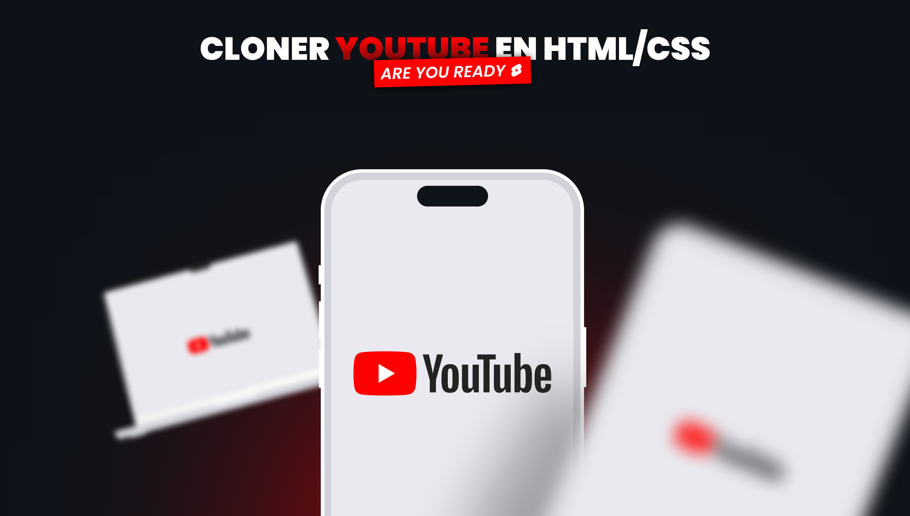
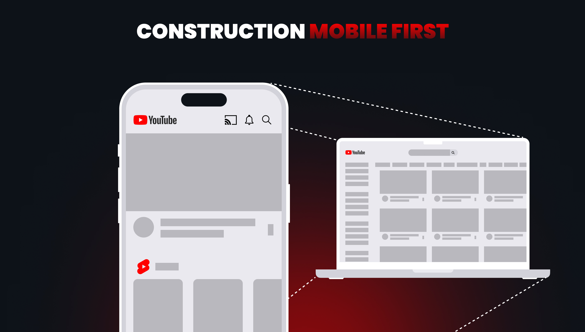
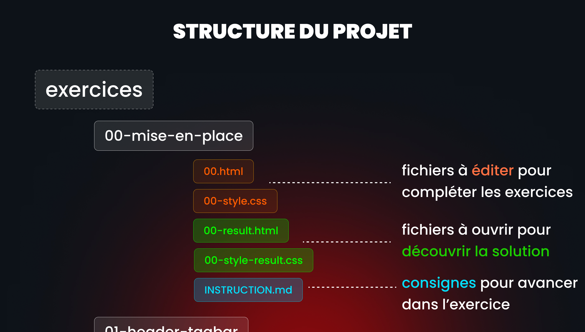

## INTRODUCTION - Mise en place du projet



Avant de débuter le projet voici quelques points importants à noter →

90% de ce que nous allons aborder dans ce projet à déjà été vu dans les modules précédents, pour les 10 autres pourcents, soit je te guiderait soit je te demanderais de faire tes propres recherches et de résoudres les difficultés en cherchant les bonnes informations. (C’est finalement ce que fait un développeur, ce sera donc un bon entraînement)

Cette version vise à maitriser parfaitement les notions vu jusque là mais rassure toi nous aurons l’occasion de faire une version 2 avec REACT dans les prochains modules. ce que je veux ici c’est m’assurer que tu es à l’aise avec le CSS avant de passer au niveau suivant.

Bon courage (c’est pas du courage mais du plaisir avant tout 😎 )

## Objectifs

- Assimiler les notions vu depuis le début
- Réussir à trouver par soit-même la réponse à certains problèmes
- Maîtriser le CSS mieux que 70% des développeurs front-end déjà en place.
- Être à l’aise avec le responsive et les media queries.

## Comment on va fonctionner ?

Tout dabord sache que nous allons avoir une approche mobile first et donc developper les fonctionnalités dabord pour le mobile puis adapter le desktop.



Dans le dossier du projet tu as un dossier qui se nomme “Exercice”.

À l’intérieur tu as les 8 dossiers contenant les exercices et solutions.

Tu vas devoir effectuer les exercices dans l’ordre de 0 au 7 eme exercice.



Un conseil, joue le jeux et regarde la solution uniquement quand tu es incapable d’avancer ou que tu penses avoir finis.

Aller trêve de blabla et commençons de suite à coder !

## INSTRUCTIONS

pour commencer nous allons définir les variables css qui nous serons utiles

tout au long du projet !

Pour ce faire j’ai préalablement analyser pour toi le site de youtube et voici toutes les variables que je vais te demander d’ajouter dès la première ligne de ton fichier `00-style.css`

je vais te donner le nom et la valeur que la clé prendra ⇒

- —font-size-corps : 1rem
- --font-size-caption: 0.618rem
- --font-size-button: 1rem
- --font-size-title: 1.2rem
- --color-background: #0f0f0f
- --color-corps-text: #aaaaaa
- --color-white-a: #121212
- --color-white-a1: #3c3c3c
- --color-white-a2: #4a4a4a
- --color-white-a3: #797979
- --gap-thin: 0.5rem
- --gap-small: 1rem
- --gap-medium: 2rem
- --gap-large: 3rem

Une fois cela fait je vais te demander de compléter les zones commenté dans le CSS pour ajouter les bonnes variables et les bonnes media queries !

Hésite pas à ouvrir la page html du résultat pour voir si tu avance correctement dans ton exercice pour comparer ta version avec la bonne version.

## **🐜 Ton avis compte**

### Partage tes impressions et suggestions via ce formulaire de feedback

```css
https: //go.mikecodeur.com/cours-react-avis?entry.1912869708=TypeScript%20PRO&entry.1430994900=2.Les%20Fondamentaux&entry.533578441=01%20Les%20bases;
```
