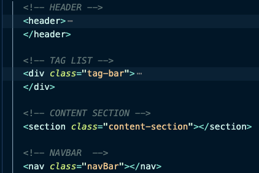
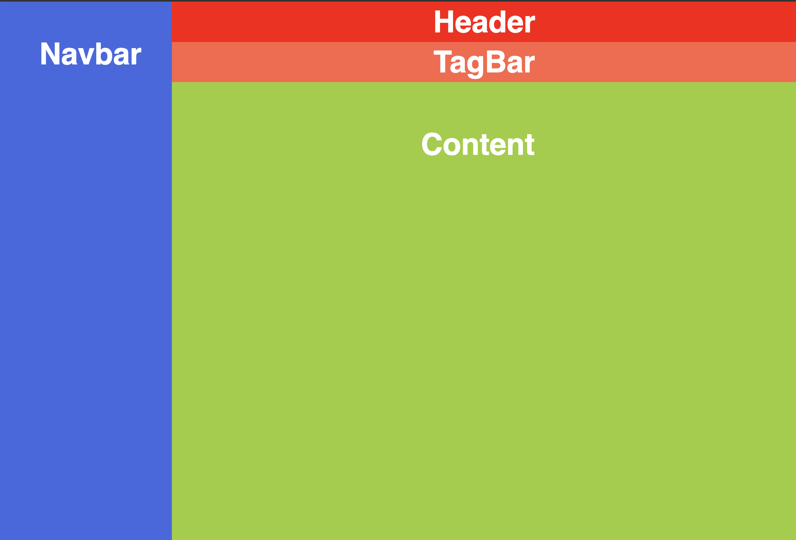
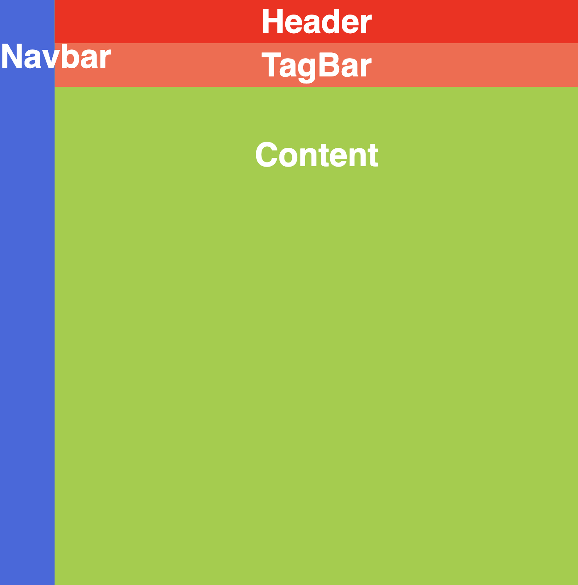
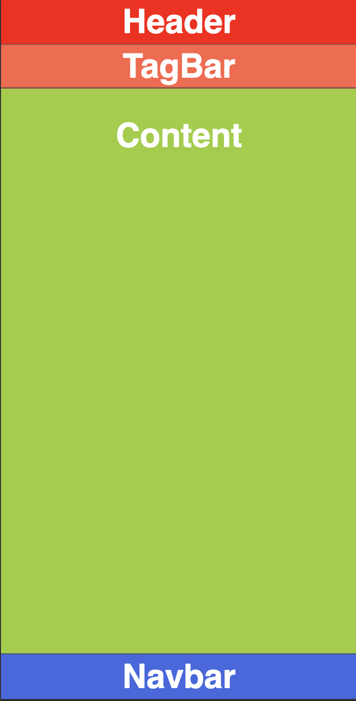
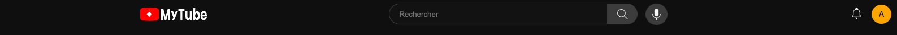
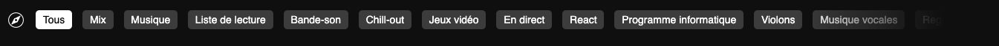
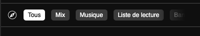

## Exo 1 - créer le Header & TagBar

Dans ce premier module nous allons créer le header principal de youtube.

Nous allons avoir une approche mobile first pour tous les exercices pour 2 raisons :

- Youtube est une plateforme extrêmement convoité des utilisateurs mobile.
- Tu vas te challenger et te forcer à développer différemment.

```
⚡️ Comme déjà mentionné précédemment , l’approche mobile first
est interessante dans la plupart des cas.
Je ne le recommande pas forcément pour un site / App de bureautique par exemple
où la majorité de nos users seront sur un ordinateur.
Attention cela ne veux pas dire que le responsive ne doit pas être effectué.
```

Je t’ai déjà donné le code html, nous allons nous concentrer principalement sur le code CSS.



Pour débuter schématisons simplement comment notre application va se construire, cela nous aidera pour la suite.

Voici 3 écrans ⇒ Ordinateur / Tablette et Mobile



<table>
  <tr>
    <td>
      
    </td>
    <td>
      

   </td>
  </tr>
</table>

# **Instructions 1.1**

👨‍✈️ Hugo le chef de projet nous demande de créer le header ainsi que la tagbar de youtube.

Dans cet exercice tu va devoir créer le **header** qui contient.

- sur Mobile & Tablette :
  - Le logo
  - L’icone “Search”
  - L’icone “Notification”
  - L’avatar
- sur Ordinateur :
  - Le logo
  - L’input “Rechercher”
  - L’icone “Search”
  - L’icone “Vocal”
  - L’icone “Notification”
  - L’avatar




# **Instructions 1.2**

👨‍✈️ Hugo le chef de projet nous demande de créer la Tagbar de youtube.

On va travailler l’overflow ! Tu peux voir que la tagbar contient beaucoup d’élément html, le but va être de faire déborder tout ce contenu sur l’axe horizontal pour obtenir un scroll.

Sur mobile comme sur ordinateur le comportement est le même, la seule nuance est que sur mobile nous avons un `border-top` et `border-bottom` de 1px avec la variable `—color-white-a2` pour la couleur

Petit challenge supplémentaire ⇒ obtenir cet effet de fondu sur la droite en utilisant la propriété css `mask-image`





## **🐜 Ton avis compte**

### Partage tes impressions et suggestions via ce formulaire de feedback
